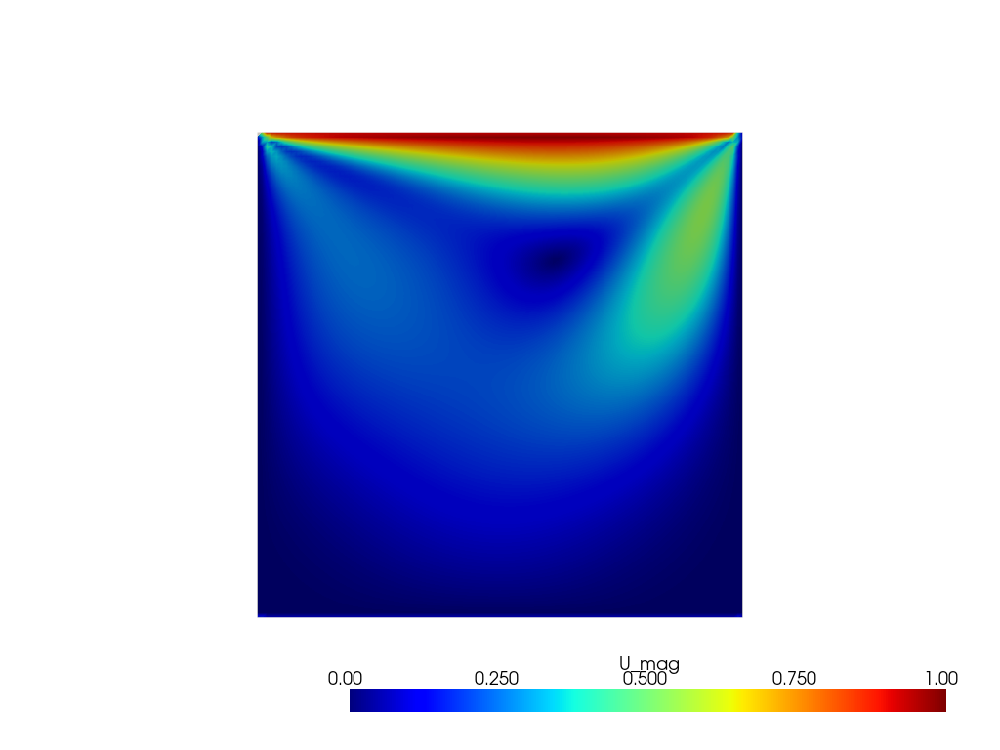
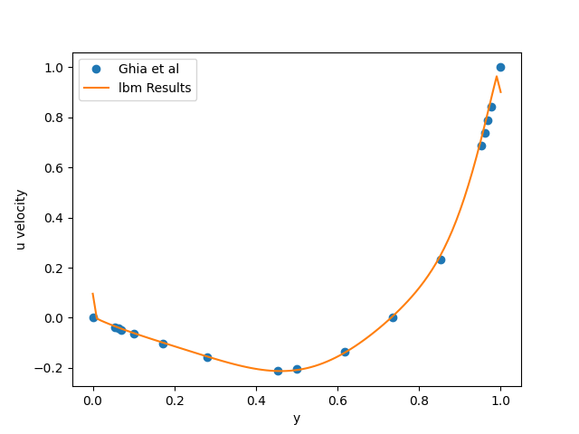
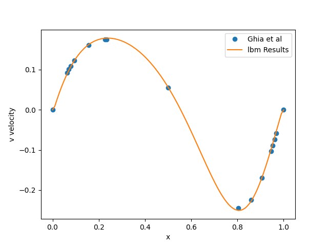

# MOJO-LBM-Tutorial

Implementation and analysis of LBM on GPU using Mojo Programming Language

<table>
  <tr>
    <td align="center"></td>
    <td align="center"></td>
    <td align="center"></td>
  </tr>
  <tr>
    <td align="center">LDC Vel Magnitude Re=100</td>
    <td align="center">u Benchmark Results</td>
    <td align="center">v Benchmark Results</td>
  </tr>
</table>

## Features
1. Single SRT Kernel serves for all dimensions and lattice models (D2Q9, D3Q19 and D3Q27) leveraging mojo metaprogramming
2. Layout independent kernel so works for row/col major arrays and tiled arrays (e.g. a row major tile embedded in a col major tiler) using natual indexing (x,y,z,q indexing). Tile size can be adjusted
3. Leverages **only** the mojo std library for setup and solver (leverages python for basic visualisation)
4. DDF shifting for improved numerical stability and Float16c for stable 16 bit simulations see [Fluidx3D](https://github.com/ProjectPhysX/FluidX3D) and [Paper](https://www.researchgate.net/publication/362275548_Accuracy_and_performance_of_the_lattice_Boltzmann_method_with_64-bit_32-bit_and_customized_16-bit_number_formats))

4. For FP32/FP32 256^3 cube ~ 2200 MLUPs for D3Q19 on RTX 2070 Super
5. Run on Nvidia, AMD and Apple GPUs

## Limitations
1. Single GPU Only for now
2. Only Bounceback BC and bounceback with applied velocity availiable
3. No async loading (only availiable for NVIDIA Ampere and above) for shared memory load for flags

## LBM
Lattice Boltzmann Method (LBM) is a fluid simulation based on the Boltzmann Equation and specifically made for GPU like compute. It is an explicit time stepping algorithim (so no solving systems of equations) and performed on a structured grid. The Single relaxation time (SRT) model implemented is designed for incompressible flow (Mach number less than 0.3)

Its simplicity allows one to capture fluid motion in a single tight kernel ~ 50 lines.

### Steps
1. Stream Populations And Apply BC (I use a pulled approach here)
2. Calculate Post BC and streamed velocity and density 
3. Compute Collision Step

## D3Q19 Benchmark LDC Cube 256^3

``` bash
Benchmark for fp32/fp32 LBM
Grid Shape: 256,256,256
Num Points On grid: 16,777,216

Non Tiled Grid Dim: (32, 32, 32) Block_Shape (8, 8, 8) 
Tiled Grid Dim: (32, 32, 32) Block_Shape (8, 8, 8) 

Version: 1.0.0b2
| name                                                      | met (ms)           | iters |
| --------------------------------------------------------- | ------------------ | ----- |
| 2. Base Col Major SoA                                     | 12.228749          | 10    |
| 3. Tile Col, Tiler Row                                    | 7.6094429          | 10    |
| 4. Tile Row, Tile Col                                     | 18.769728          | 10    |
| 5. Tile Col, Tiler Col                                    | 7.5412925          | 10    |
| 6. Tile Row, Tiler Row                                    | 17.9165283         | 10    |
| 7. Shared Memory For Flags tile, Global Pull For boundary | 8.013021           | 10    |
| 8. Map Flags from Tile+ Halo region to Shared             | 7.4686653000000005 | 10    |


Version: 1.0.0b1
| name                                                      | met (ms)           | iters |
| --------------------------------------------------------- | ------------------ | ----- |
| 1. Base Row Major AoS                                     | 33.597061100000005 | 10    |
| 2. Base Col Major SoA                                     | 12.0542205         | 10    |
| 3. Tile Col, Tiler Row                                    | 8.4702178          | 10    |
| 4. Tile Row, Tile Col                                     | 17.895464999999998 | 10    |
| 5. Tile Col, Tiler Col                                    | 8.0567901          | 10    |
| 6. Tile Row, Tiler Row                                    | 18.3676544         | 10    |
| 7. Shared Memory For Flags tile, Global Pull For boundary | 8.5808067          | 10    |
| 8. Map Flags + Halo region to Shared                      | 7.9359169          | 10    |

```

MLUP for best run  2000 - 2200 MLUPs on RTX 2070 Super 


## Key Optimisations
1. Using Tiled Layout: Tile is Column Major AoS (x,y,z,q) with Column Major Tiler (threading index is aligned with e.g. x = thread_idx.x to allow for different dimensions on the grid)
2. Comptime For loop to unroll all loops inside the kernel
3. Float16c to halve memory bandwidth and footprint (~2x speedup) and DDF Shifting to reduce numerical tradeoff (learnt from Fluidx3D and [Paper](https://www.researchgate.net/publication/362275548_Accuracy_and_performance_of_the_lattice_Boltzmann_method_with_64-bit_32-bit_and_customized_16-bit_number_formats))

## Custom Structs

### Vector
Stack allocated vector with value semantics (i.e. ImplicitelyCopyable Trait and so behaves like a number) and support for standard ops (+-*/) with same vector type or scalars. Also support sum, prod with oneself and dot product with another vector. An InlineArray stores the data inside the vector.

Currently Not Simd optimized for large vector (uses simple for loops)

### ContextTileTensor
Simple Struct that manages the host and device buffer together and keeps the 2 buffers in sync. Uses  `.cpu()` and `.gpu()` getters to call the buffer as a
TileTensor on the cpu or gpu respecitively. Buffer copies between the 2 buffers only occur when we call different buffers in a row.

```mojo
    a = ContextTileTensor(ctx,layout)
    cpu_tensor = a.cpu() # No Copy as initial call
    # Some CPU Work Here
    # ...
    gpu_tensor = a.gpu() # Copy is performed from Host Buffer (CPU) to Device Buffer (GPU)
    # Some Gpu Work Here...
    gpu_tensor2 = a.gpu() # No Copy as last call was the same GPU
      
    cpu_tensor = a.cpu() # Copy is perfomed from GPU to CPU
```

## Goals for thie project

1. Learning Correct Typing and Parameterization in Mojo
    a. Supports any DType Floating point (mainly fp32 or fp64)
2. GPU kernels and TileTensor Layouts
3. How to call Python Modules in Mojo:
    a. Passing buffers into Numpy arrays with Unsafe Pointers
    b. Using Pyvista for Visualisation
4. Creating Custom structs and functions to reduce repeated code (e.g. vector, contextTileTensor)
5. Basic Origin tracking
6. Mojo Packaging

## Timeline
- 2026/06/25 Added DDF shifting and Float16c support see [Paper](https://www.researchgate.net/publication/362275548_Accuracy_and_performance_of_the_lattice_Boltzmann_method_with_64-bit_32-bit_and_customized_16-bit_number_formats)

- 2026/06/24 Added D3Q27 Models
- 2026/06/12 Implemented 3D D3Q19 LBM and non square grids
- 2026/06/05 Implemented TiledLayouts for LBM
- 2026/06/04 Implemeted First Variation that uses thread reording
- 2026/05/20 LBM working with mid-gridbounce bounceback and moving wall BC. Row Major. Base Example

# ToDo
- [X] Create function to set BC - Moving and No Slip
- [X] Create LBM kernel with mid grid bounceback

## Optimisation Tasks
- [X] Use Benchmarking to determine speed ups and optimisations 
- [] Add Simd optimisation
- [X] Add Layout Analysis
- [] Swizzling analysis

## Other
- [X] Implement 3D lattices models
- [] Implement Custom Floating Point
- [] Equilibrium Conditions


# Reflection
- 2026/05/12
    - Awkward slicing syntax
    - Type System can be annoying
    - Int and Scalar[Dtype.int32] for Gpu kernels type mismatching
    - Lack of clarity what can be passed to GPU
    - Very Barebones so have to basically build everything from scratch
    - Maybe to low level for now to incentivise a switch from CUDA or Python DSLs

- 2026_05/14
    - Optional is weird and doesnt make sense
    - Bool dont have __is__ implemented so foo is False does not work

- 2026_05_19
    - While theyare building some awesome stuff, the QA and actual usage of the language features in more realistic context can be a bit lacking 
    - A python User, because Mojo is targeted for systems (i.e. "low level") programming design, 
        theres a significant gap between using std builtins and Python functions. Might be unavoidable.